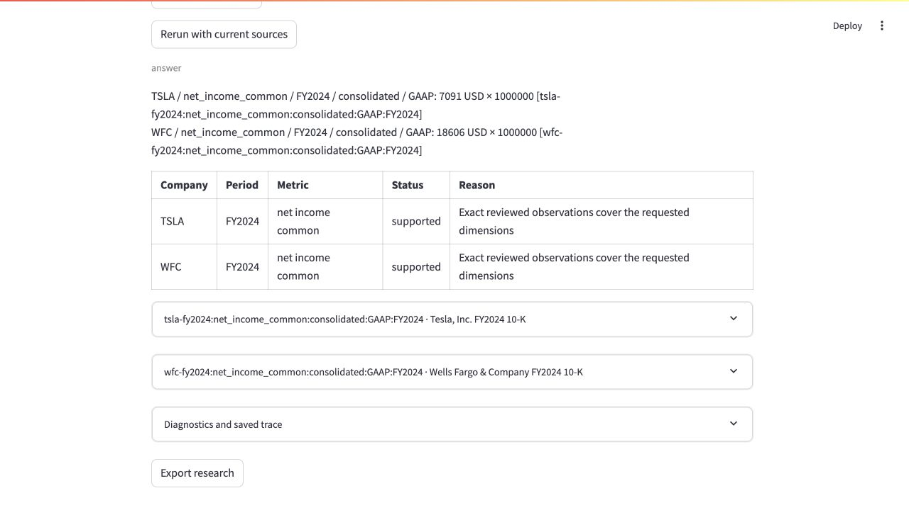

# Fin-RAG-Lab

A local financial research prototype for Wells Fargo, Tesla and AMD reports, with cited Ask answers, reviewed facts, checked calculations and immutable saved research. The development corpus contains 22 official originals and 168 named Codex-reviewed fact cards. Independent authentic release validation remains held.

**Start with [docs/INDEX.md](docs/INDEX.md)** for the [current state and next work](docs/STATE.md), active plans, decisions, contracts and retained evidence. Contributors and agents follow [CONTRIBUTING.md](CONTRIBUTING.md).

[](https://github.com/daniel-li2021/fin-rag-lab/actions/workflows/ci.yml)
[](LICENSE)
[](https://www.python.org/downloads/)

## Persistent research quickstart

```sh
pip install -r requirements.txt -r requirements-persistence.txt pgserver==0.1.4
# Supply OPENAI_API_KEY privately in the ignored .env or environment.
python scripts/local_postgres.py start
set -a
source index/product-local/runtime.env
set +a
GENERATOR_MODEL=gpt-6-luna REASONING_EFFORT=none python -m streamlit run app/streamlit_app.py \
  --server.address 127.0.0.1 --server.port 8502
```

This reuses the existing private local cluster and source/build identities. A fresh checkout needs acquisition, reviewed window ingestion, original bindings and its own capture manifest; tracked receipts do not distribute ignored originals/database state. Follow [local runtime](docs/PRODUCT_LOCAL_RUNTIME.md) and [persistence](docs/PERSISTENCE.md) for those boundaries. Explicit exported settings take precedence over dotenv fallbacks.

Start in **Research**, choose a collection or narrow source selection, and use Lookup, Compare, Trend, Profit margin or operating calculations. Supply explicit company/period/scope/basis; missing evidence stays visible and every issued calculation cites both reviewed operands. **Library** shows metadata review and build/fact/partial-page coverage. **History** reopens saved results without rerunning; an explicit rerun creates another result with evidence/result changes. Source edits and fact import are under **Owner administration**.

Try **FY2024 common-income comparison** with `compare GAAP consolidated net income attributable to common for TSLA and WFC in FY2024`, inspect original attribution/period/unit citations, then open History and explicitly rerun. Eight local collections and saved development runs are prepared. Optional narrative drafts are visibly unreviewed. [Research routes and limits](docs/kb/RESEARCH.md), [metric policy](docs/PRODUCT_METRIC_POLICY.md).



Keep Streamlit on loopback or an authenticated private connection: local administration is not multi-user authorization. The [private API](docs/PERSISTENCE.md) provides single-owner bearer authentication; the [Docker profile](docs/PRIVATE_DEPLOYMENT.md) is prepared and locally validated, without a cloud deployment claim.

## Teaching and compatibility path

The seven [notebooks and local usage guide](docs/kb/NOTEBOOKS.md) explain parsing, chunking, retrieval, generation and offline evaluation. Without `DATABASE_URL`, Streamlit uses the local Chroma compatibility service. The [current architecture](docs/kb/ARCHITECTURE.md) explains both paths and their shared modules.

## Results and contribution

The [development capture report](docs/PRODUCT_DEVELOPMENT_CAPTURE.md) and [immutable results ledger](docs/benchmarks/20261003-product-development/README.md) separate mechanical/numeric checks, Codex development review, unknown metrics and independent release requirements. Historical notebook scores and the [October 2 phase-close results](docs/PHASE_CLOSE_REPORT.md) describe their own configurations.

Run `python scripts/check_docs.py` after documentation changes. Implementation, evidence updates and `AUTO`/`REVIEW` integration use the single workflow in [CONTRIBUTING](CONTRIBUTING.md). License: [MIT](LICENSE).
