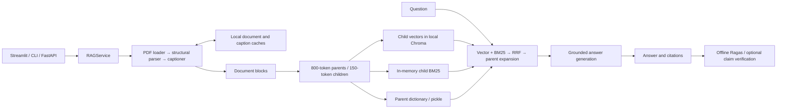
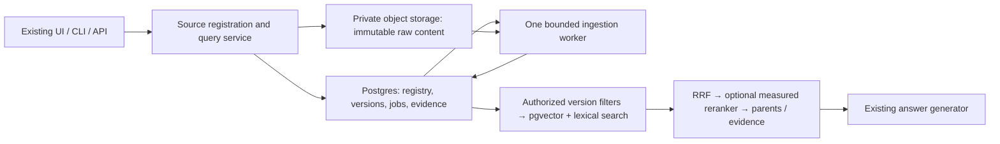

# FinRAG next-phase architecture and work plan

Historical phase-close snapshot: October 2, 2026 against local `main` at `832e59f`, with subsequent Phase 3 status linked below. Items 01–12 are implemented and locally validated; financial evidence controls are implemented, with quality promotion held. The original investigation and proposal are retained below as history. For the October 3 review of `main` at `00d5338` and the proposed next development batch, see [the product review](PRODUCT_NEXT_BATCH_PLAN.md).

The original review examined `4b4a95f8b42d46a6fd7a0e459c072fe228490a7f`, which matched `origin/main` at that time. Its no-ingestion/no-model-call scope and architecture findings describe that investigation, not the subsequent implementation and benchmark. Issue titles 01–12 are historical draft boundaries, not published GitHub issues.

The [Phase 3 plan](PHASE_3_PLAN.md) reviews this foundation and the held financial experiments. [Current implementation](PHASE_3_IMPLEMENTATION.md) includes immutable reviewed facts, pinned numeric research, calculation receipts, finite question templates, bounded original-passage search, collections and saved research history with reruns in the existing graph/API/Streamlit app. Authentic bindings, sealed holdout evaluation and reviewed narrative synthesis keep release promotion held; the optional planner remains disabled.

## Implemented next phase: financial evidence controls

The [frozen phase-close report](PHASE_CLOSE_REPORT.md) remains the baseline: strict **19/30**, numeric **9/10**, clarification **0/3**, OOC refusal **4/4**, complete cross-document answers **1/4**, final evidence recall **0.673** over 26 supported questions and receipt-based cost **$0.019366155**. Original questions, labels, PDFs, retained chunks/vectors and baseline outputs are unchanged.

| Implemented boundary | Runtime behavior | Validation / remaining limit |
|---|---|---|
| Source-aware clarification | Confirmed company aliases from the authorized source/version snapshot trigger questions about missing comparison period, revenue definition and margin scope/basis before any model call. Unsupported companies still use the refusal policy. | q18/q23/q24 clarify correctly, without figures or model calls; 4/4 OOC refusals retained. This is a narrow semantic guard, not a complete financial query parser. |
| Routing and opt-in original context | Short outlook/growth/performance/risk/comparison questions use deep retrieval. Opt-in generation assembles deduplicated, same-version original span text with page/document/version markers, excluding inherited headings and generated captions. Legacy/generated-only context is explicitly unverified. | Original boundaries, IDs, stored payloads and vector inputs are unchanged. This repairs presentation interruptions without re-ingestion. |
| Bounded evidence profile | Request `supplement_k=1..8`; default is **0**. Keep ranked parents, append uncovered candidate parents with two reserved lexical slots, then positive-score original-parent BM25 evidence. Explicit growth requests have one small lexical synonym probe. | At 8: final recall **0.897**, complete evidence **23/26** versus **16/26**. Candidate rankings match all 30 frozen rows. Owner/source/version restrictions remain in force. This increases context, not the common 2,400-token experimental budget. |
| Original quote binding | The opt-in profile requests exact supporting quotes; unique original document/version proof can repair a wrong footnote. Missing, ambiguous or malformed support produces a fact-free refusal. Cited model clarifications also pass the guard. | Numeric-only/generated/old-version quotes cannot prove support. Exact location is **not** semantic entailment: a title quote alone still cannot prove a financial claim. Broad unsupported prose requires source review. |
| Checked arithmetic | Optional structured operands require original quotes, explicit periods, company/metric/scope/basis/unit comparability, and checked `Decimal` difference, percentage-point change or growth. Only validated placeholders receive computed results and operand citations. | Quarterly/YTD mixing, missing operands and zero growth denominators reject. Sparse labels cause conservative refusals; row/column association and arithmetic written outside the structured envelope remain review limitations. |

Both APIs and the shared local/persistent query pipeline accept the bounded request option. A positive `supplement_k` also enables the experimental quote/calculation response protocol; ordinary requests keep the existing response protocol. Source-aware clarification and semantic routing are shared improvements. Ordinary generation retains the frozen baseline prompt/context format; original-span presentation and the response protocol are opt-in. Benchmark `--ids` supports bounded regression subsets; `--reuse-query-embeddings` reuses the existing same-model input-hash cache on Postgres. No new model, reranker, agent framework, ingestion, embedding or cloud resource is needed.

### Measured result and promotion decision

The [quote-bound 30-question capture](benchmarks/20261002-financial-answers-bound/manifest.json), [immutable outputs](benchmarks/20261002-financial-answers-bound/results.jsonl), [source review](benchmarks/20261002-financial-answers-bound/review.json), [reviewed summary](benchmarks/20261002-financial-answers-bound/reviewed_summary.json), [paired deltas](benchmarks/20261002-financial-answers-bound/paired_summary.json) and [measured cost](benchmarks/20261002-financial-answers-bound/measured_cost.json) record **14/30 strict**, **5/10 numeric**, **3/3 clarifications**, **4/4 OOC**, and **2/4 strict cross-document**. The guard fixed q06's exact-value citation and allowed q15's supported limited answer, but fourteen supported questions refused. q13 has one conservatively reviewed unsupported/wrong-period April qualifier. Strict successes were lost, so this is **not a completed quality phase or a promoted default**.

There were 27 generator calls, zero fresh embedding calls and no ingestion/judge calls. Receipt-based cost is **$0.029741935** (+53.6% versus baseline); service p95 is **3.813 s** versus **3.261 s** (+16.9%). Cache reuse and different runtime conditions limit causal comparisons. Final evidence recall improved by **0.224**, but that does not compensate for correctness failures or establish a controlled-budget retrieval promotion. The original numeric +2 promotion gate is unchanged; the 9/10 baseline cannot satisfy it with only one available additional success.

The capture predates isolation of the protocol behind `supplement_k`; its `code.patch` preserves the exact captured implementation. [Post-capture changes](benchmarks/20261002-financial-answers-bound/post_capture_changes.json) document that isolation. The [final default regression subset](benchmarks/20261002-financial-default-final/manifest.json) validates the final default path separately and is not a replacement 30-question benchmark. Earlier failed screens, the malformed-source partial capture and their receipts are retained; none is relabeled as a success. Its [reviewed12-question default subset](benchmarks/20261002-financial-default-final/reviewed_summary.json) has **7/12 strict**, **3/3 reviewed numeric**, all three clarification cases correct, and one q11 wrong-period provision trend. q12/q26 have unnecessary qualified outcomes; q19/q20 omit rubric details, and q26 lacks one credit-risk citation. The subset cost is **$0.007360825** across nine model calls and zero embeddings. These remaining model failures preclude an overall improvement claim even with the frozen default prompt/context preserved.

**Acceptance still required:** eliminate unnecessary refusals with independently bound supporting rows/columns, repair the temporal qualifier and preserve every formerly strict-correct answer. Require all financial assertions to have supporting issued citations, zero unsupported/wrong-period claims, complete comparison evidence, and known cost/latency before considering promotion. Keep `golden.jsonl`/`labels.v1.json` fixed; capture and review any subsequent correction in a new directory. Do not infer model quality from fake-model tests or relax existing [promotion gates](BENCHMARK.md).

Seventy focused offline checks pass. A disposable restore verified retained corpus identity and source/version/owner isolation; the task-created database is removed after validation. Cloud provisioning, sustained-load claims and contextual retrieval promotion remain outside this local implementation.

Publication validation on October 2: 58 relevant generator, query/retrieval coverage, service, benchmark/review, usage, private-runtime and API checks pass. Offline replay confirms the baseline and four reviewed successor captures; successor golden/label/corpus identities match the baseline. This validates the existing batch for publication, not financial quality promotion. No new ingestion, model call, database restore or cloud check was performed for publication.

## Historical recommendation and implementation boundaries

Build a durable source registry and trustworthy evaluation/provenance first. Keep the existing parent-child hybrid retriever as the default while testing contextual retrieval separately. Use one Postgres database with pgvector plus private object storage for the production data plane. Preserve the current service/API/UI structure; a new agent framework, separate vector service, and search cluster are unnecessary at this stage.

### 1. Architecture at the original review



**Source flow.** `RAGService.ingest_and_index()` validates local PDF paths, ingests each selected file, chunks the documents, indexes all children, and writes local artifacts. Every call rebuilds the entire selected corpus, including `reset=False`. FastAPI `/ingest` passes a single PDF, so ingesting B after A replaces A's searchable corpus. Streamlit explicitly offers a corpus rebuild. The `Document.source_type` enum lists additional formats, but there are no working text/Markdown or URL registration paths. See [service](../src/services/rag_service.py), [ingestion](../src/pipelines/ingestion.py), [API](../src/api/server.py), and [UI](../app/streamlit_app.py).

**Current metadata.** `Document` holds a random document ID, title, source type/path/hash, uploader, creation time, tenant placeholder, page counts, and blocks. `IndexedDocument` retains an even smaller summary. There is no authoritative source identity, company, reporting-period model, business document type, version history, review status, or per-source archive/update operation. Cold parsing creates new document/block IDs; chunk IDs are regenerated on every chunking pass. Cache hits can retain old paths and IDs, so cache identity is not business identity. See [models](../src/core/models.py).

**Current storage locations.** Paths below are relative to the repository unless explicitly overridden.

- **Raw files:** `data/uploads/*.pdf`. UI uploads use the supplied filename and can overwrite an existing file. Four PDFs exist locally; the saved application index lists three financial documents, excluding the synthetic test PDF.
- **Parsed text, blocks, table rows and captions:** `cache/docs/<cache-key>.pkl`, under the `docs` namespace. This contains the post-captioning `Document`; image bytes are removed before persistence. Bounding boxes, raw table rows/text and generated semantic captions exist in the block model, but are not all exposed through retrieval.
- **Caption cache:** `cache/vlm/<cache-key>.pkl`. Table captions include prompt text in the key; image captions key on image bytes plus model, omitting document/heading context. Whole-document keys include content hash, parser name, page selection and captioner model, but not every parser parameter or prompt revision.
- **Children / chunk text:** `index/children.pkl` and Chroma's stored child documents. BM25 is rebuilt in RAM from the children on each service load; there is no persistent standalone BM25 index.
- **Parents / generation context:** `index/parents.pkl`, loaded into a dictionary keyed by parent chunk ID.
- **Embeddings and vector index:** `index/chroma/`, including `chroma.sqlite3` and vector-index segment files. `cache/embeddings/` additionally holds reusable content/model-keyed embeddings. Direct notebook retrievers can use separate `chroma_db*` / `tmp_chroma_*` directories; they are not the app index.
- **Corpus summary / configuration:** `index/index_meta.json`. Current code writes model names, but the existing local artifact lacks them and contains absolute paths from an older checkout. Loading does not validate saved versus runtime embedding configuration, nor check that the vector store matches the pickle files.
- **Evaluation:** `data/golden_set/golden.jsonl`; local, gitignored `tmp_baseline_ragas.csv`, `tmp_improved_ragas.csv`, `tmp_app_ragas.csv`; saved notebook outputs. Costs/traces are process-local counters and optional LangSmith tracing, not durable ingestion/query records.

The saved app artifact has **3 documents, 85 parents and 572 children**, and its Chroma collection reports **1,536 dimensions**. These are observed existing artifacts, not a fresh ingestion. The app index occupies about 13.7 MB and embedding cache about 59.6 MB, including cached work beyond the current collection; these are filesystem totals, not production sizing estimates.

**Retrieval details.** Parent size is 800 tokens with 80-token overlap; child size is 150 with 20-token overlap. Heading strings are inserted into the text. Vector and BM25 each retrieve 20 children, sequentially, before RRF (`k=60`) keeps 20 candidates. Expansion swaps children for distinct parents, returning at most 3 parents for short factual queries or 8 for analytical queries. Both paths expand parents. There is no reranker, company/period/source filter, score threshold, or document-coverage requirement. Missing parents are silently skipped. See [chunker](../src/chunkers/parent_child.py), [hybrid](../src/retrievers/hybrid.py), [query routing](../src/pipelines/query.py).

### 2. Gaps identified at the original review

1. **Unsafe replacement lifecycle.** `_reset_index_state()` removes the live vector/pickle/metadata artifacts before parsing and embedding succeed. Failed ingestion destroys availability of the prior good index. Independent file writes and shared mutable service state also create consistency risks during simultaneous ingest/query or multiple app workers.
2. **Weak source/version identity.** Paths and filenames identify uploads; changing content, refreshing a URL, amending a filing, deduplicating a blob, and registering a separate source cannot be represented reliably.
3. **Evidence can be lost or mislabeled.** `get_embed_text()` prefers generated captions over raw table text; the parent-child chunker then uses that same text for answer context. Detailed rows can therefore disappear from the generation path. Parent-child chunks do not populate source block IDs or structured heading paths. Their page locator advances past the previous chunk's end despite overlap, and children inherit only the parent's first page. The stored Chroma artifact contains **246/572 children with page number 0**, meaning unknown. Multi-page source spans need explicit provenance.
4. **Grounding/refusal is largely a prompt convention.** Non-empty nearest-neighbor output is not proof of relevance. BM25 returns top-ranked entries even at zero lexical score. The generator's `refused` flag recognizes a fixed empty-result message, but not its ordinary structured prose refusals. The service displays retrieved chunks as fallback citations even when the answer cites none. The API drops document identity from citation responses. These prevent reliable refusal/citation scoring and cross-source auditing.
5. **Evaluation cannot yet decide numerical correctness.** Eight of ten `fact_finding` reference answers omit the requested numeric value. All four `cross_doc` rows use `expected_doc=any`, and the evaluator ignores this field. The revenue comparison mixes filing periods; the margin comparison conflates Tesla automotive margin with AMD overall margin. Their expected outcomes must explicitly state whether comparison is valid, needs qualification, or needs clarification. Numeric-density diagnostics are useful debugging proxies, not evidence-recall metrics.
6. **Cost and reproducibility claims need repair.** Embedding calls do not reach `record_embedding()`. Request breakdowns are cumulative, optional verification is outside the measured query latency/cost interval, unknown models are assigned zero cost, and output usage plus reasoning details are added together. OpenAI reports reasoning as part of completion usage, so this can double-count output. Persist raw usage and mark unpriced usage unknown. See [tracker](../src/observability/cost_tracker.py) and [OpenAI usage contract](https://github.com/openai/openai-python/blob/main/src/openai/types/completion_usage.py).

Saved 30-question CSV averages, recomputed with Python's standard library, are:

```text
                         recursive baseline    parent-child
faithfulness                 0.7858                0.8692
answer relevancy             0.4128                0.6161
context precision            0.3838                0.7500
context recall               0.5000                0.6500
cross_doc context recall     0.2500                0.2500  (4 questions)
```

They support preserving parent-child as a baseline, but differ from README headline numbers. They lack a complete run manifest, use incomplete references, and should not be treated as results from today's code/models. `tmp_app_ragas.csv` covers only the first five factual questions. The notebook's 4/4 refusal result uses substring checks such as “what I found”; it is not sufficient proof that all unsupported claims were withheld.

### 3. Source registry and deterministic business rules

Use **source → immutable source version → derived retrieval build**. Keep source identity separate from byte identity.

**Proposed source metadata contract:**

- `source_id`: server-assigned stable UUID; `tenant_id`/owner is enforced, even if the first deployment has one owner.
- `type`: `pdf | text | markdown | url`, describing how the source was registered. For URLs, separately record resolved media type (`pdf | html | text | markdown`).
- `title`: supplied title, explicit document metadata, or safe filename/URL fallback, in that order.
- `company`: canonical company ID plus display name, resolved through exact identifiers or a small reviewed alias map; nullable when unresolved.
- `period`: fiscal year/quarter and explicit period start/end dates where known; annual/quarterly/event/unknown kind. Preserve the original label and evidence. Publication date is separate. AMD's quarter/full-year deck can cover multiple periods; a primary reporting period must not imply every number has that period.
- `document_type`: `10-K | 10-Q | earnings_release | earnings_presentation | transcript | note | article | other | unknown`; this is business meaning, separate from file format.
- `version` and `content_sha256`: monotonic source version number and full byte hash. Store `source_version_id`, `supersedes_version_id`, original locator, private object key, media type, fetched/uploaded time and confirmed metadata snapshot.
- `status`: registration/processing status (`registered | pending | processing | ready | failed | archived`), plus separate metadata review status (`unreviewed | confirmed | needs_review`). A failed refresh must not hide the active last-good version.
- `active_version_id` / `active_build_id`: pointers to validated searchable content. Record error reason and attempt status separately from these pointers.

**Deterministic responsibilities:** validate file/media type and size, hash bytes, allocate IDs, normalize safe URL components, deduplicate exact bytes within an authorized scope, resolve exact company identifiers, parse explicit period/date patterns, preserve user-confirmed fields, enforce status transitions, select versions, authorize access, filter retrieval, calculate numeric comparisons, and link citations. Do not equate same title/company/quarter with identical documents. Identical bytes can share a blob without merging two separately registered sources. An amended filing creates a new version; it does not erase the old one.

**Ambiguity handling:** preserve an unknown or review-needed value instead of guessing a quarter from a publication date or filename. LLM suggestions carry supporting page/span, model/prompt version and confidence; confidence alone cannot authorize a financial filter or overwrite confirmed fields.

**Type-specific behavior:**

- PDF: reuse the current loader/parser; derive searchable text without losing source table/image evidence.
- Text/Markdown: UTF-8 text and Markdown headings become ordinary blocks; line ranges/section anchors replace PDF pages. No PDF parser, VLM call, or LLM classification is required for explicit headings/front matter.
- Bookmark: registration stores URL/title/metadata immediately. **A bookmark is not searchable page content.** Explicit fetch captures one bounded snapshot; extraction or failure gets a distinct status. Do not embed the URL string and treat it as evidence of the page's claims.
- URL snapshot: HTTP(S) only; validate resolved addresses and every redirect against private/loopback/link-local destinations, with timeout, byte, page and redirect limits. Start with public IR/filing URLs and ordinary HTML/PDF/text; no crawling, login scraping, or browser rendering. Keep final URL, retrieval time, ETag/Last-Modified when present, response type and raw snapshot hash. Unchanged content creates no new content version or embedding charge.

### 4. Recommended persistent architecture



**Object storage:** originals and immutable URL snapshots, plus extracted image/page assets when needed to inspect citations. Keys use tenant/source/version or content hash, not user filenames. Record hash and size in Postgres; serve authorized, short-lived downloads. Local disk is a disposable cache. Avoid duplicating every small text field in object storage.

**Relational records:** start with `sources`, `source_versions`, `blocks`, `chunks`, `chunk_embeddings`, and `ingestion_jobs`.

- `sources` owns identity, source kind, confirmed business metadata, owner and active-version pointer.
- `source_versions` owns immutable raw-object references/hash, version-specific metadata, coverage/page selection, and active retrieval-build pointer.
- `blocks` stores original text/table rows, captions in separate fields, page/line/span/bounding-box evidence and asset references.
- `chunks` stores immutable build-scoped parent/child text, parent FK, block/span references, token count and ordinal. Distinguish `original_text`, generated `context_text`, and derived `retrieval_text`; use original evidence, including raw rows, for financial answers.
- `chunk_embeddings` stores child/build/profile FK, input-text hash and vector. The profile records model, dimensions, normalization, distance metric, parser/chunker/context-prompt revision and configuration hash. A new embedding model gets a separate profile/build; it never overwrites incompatible vectors.
- `ingestion_jobs` stores stage, attempt/error, configuration manifest, usage, lease and completion state. A table-backed worker is sufficient; use existing service functions rather than introducing a broker or plugin registry.

**Vector index boundary:** the pgvector index contains the numerical embedding and reference to a searchable child row. The embedding input is child text, optionally with an approved context prefix. Parents, raw files, company/period/document-type facts, permissions, version state, table rows, citations and generated answers remain relational/object data. Embedding a company name does not implement a company filter. Apply owner/source/version/company/period constraints to both lexical and vector candidate queries before fusion; metadata is authoritative SQL data, not an LLM interpretation or duplicated vector payload.

**Search choice:** keep the current RRF combination. Begin with exact pgvector search at the present small corpus size; add HNSW only after measured latency justifies it. PostgreSQL full-text search with a GIN index is the proposed durable lexical branch, but `ts_rank`/`ts_rank_cd` is **not BM25**. Compare it separately against current BM25 before switching. In-memory BM25 can be a temporary single-worker compatibility path; do not claim it solves multi-worker persistence. Postgres supports [native text indexing/ranking](https://www.postgresql.org/docs/current/textsearch-intro.html), and [pgvector documents exact search, hybrid search and ANN tradeoffs](https://github.com/pgvector/pgvector).

**Safe publication:** persist the raw object, then create version/job metadata; parsing and remote model calls run outside database transactions. Stage all derived rows under a new build ID. Validate parent FKs, counts, input hashes, evidence spans and embedding dimensions. Atomically update the active pointers only when complete. Queries resolve the active build once per request. A failed attempt retains the previous searchable build, and retrying the same version/configuration is idempotent. Archive immediately excludes a source; explicit older-version queries remain possible. Object-store writes are not part of the SQL transaction: record incomplete uploads and clean unreferenced objects after a grace period.

**Migration:** explicitly register the three indexed PDFs; hash current raw bytes and map old document IDs to registered versions. Reuse trustworthy parsed/caption/embedding caches only when input/configuration match. The existing index identifies dimension but not embedding model, so do not infer model provenance from 1,536 dimensions alone. Unverifiable vectors require a bounded rebuild, not blind import. Keep local Chroma as the experiment reference until the persistent retriever passes parity checks.

### 5. Retrieval experiment before a default change

Parent expansion and contextualization are compatible techniques. The first comparison must isolate contextualization rather than change the storage backend, chunk size, generator and embedding model simultaneously. [Anthropic's contextual retrieval method](https://www.anthropic.com/engineering/contextual-retrieval) adds chunk-specific document context before both embedding and lexical indexing. Its reported gains are a hypothesis for this corpus, not a FinRAG result.

**Freeze the evaluation contract first.** Reuse all 30 existing questions: 10 fact-finding, 8 semantic, 4 single-document multihop, 4 cross-document, 4 out-of-corpus. Add a versioned sidecar with stable question IDs, expected outcome (`answer | qualified_answer | clarify | refuse`), allowed company/period/scope, exact numbers/units/tolerances when applicable, and required evidence spans/source versions. Label every required source for cross-document questions; do not use `any`. Preserve the original golden file for historical comparisons, and record any necessary question/reference corrections in the versioned overlay before inspecting experiment results. Ambiguous comparison questions must not reward invented comparability.

**Cheap-to-expensive arms:**

1. **A — current parent-child hybrid:** existing 800/150 chunks, 20 candidates per branch, RRF and parent expansion. Save the unmodified historical behavior, then use one common provenance/evidence-corrected baseline for all new arms.
2. **B — deterministic context + parents:** prefix searchable child text with confirmed company, reporting period, document type and heading. No additional LLM calls. Same chunk boundaries, child IDs, parent expansion and original answer evidence.
3. **C — LLM contextualization + parents:** a cached 50–100-token chunk-specific prefix, grounded in the same document, for both vector and BM25 indexing. Same boundaries and expansion as A/B. This isolates contextualization's incremental value above metadata alone.
4. **D — contextual children without parent expansion:** use C's indexed representation but return original child evidence. This measures the generation-context tradeoff. Do not pass generated context as an authoritative numeric source.

Use the same generator/prompt, judge and judge-embedding model, corpus hashes, query text, candidate limits, and source filters across arms. For primary comparison use a common **2,400-token original-evidence budget**, deduplicating overlapping spans and never padding with irrelevant text; separately replay the actual quick/deep 3/8-parent policy for deployment relevance. Generated prefix tokens and latency/cost remain measured overhead. Labels reference original spans, so chunk IDs or sizes cannot change the answer key.

**Metrics, defined before implementation:**

- Evidence recall@20 over child candidates: fraction of required original evidence spans retrieved; macro-average over supported questions.
- Evidence recall within the final token budget; MRR of the first relevant result; complete-evidence success (all required spans, and all required documents for cross-document questions). Deduplicate overlaps before scoring.
- Exact normalized numeric accuracy with units, period, entity/scope and label-defined rounding tolerances; wrong-period/scope answer count. Semantic/analytical answers get an explicit rubric.
- Citation validity and support: every claimed citation resolves to the expected immutable source version and supporting original span. Retrieval cards alone do not count as citations.
- Refusal/clarification correctness, including all four original out-of-corpus questions; count unsupported assertions even inside refusal prose. Introduce structured outcome reporting shared by every arm, not keyword matching.
- Existing four Ragas metrics as secondary diagnostics, broken down by category. Keep the judge configuration fixed when changing retrieval embeddings. Exclude inherently undefined answerability metrics for refusal questions and report that denominator.
- p50/p95 retrieval and end-to-end latency, input/output usage, cost per query, one-time ingest/context/embedding cost, repeated-ingest cache hit rate and index bytes. Use raw recorded usage; unknown pricing is not zero.

**Proposed promotion gate:** at least +0.10 absolute macro evidence recall within the same token budget; at least two additional correct numeric answers among the ten factual questions, without losing a previously correct numeric answer; no new wrong-period/scope assertions; all four out-of-corpus cases handled correctly; no broken citations; mean Ragas faithfulness regression at most 0.02. Online p95 and mean query cost may increase at most 20%; ingestion/contextualization runs under a configurable preapproved cap. Report paired per-question deltas and uncertainty; 30 questions, especially four cross-document cases, are a screening benchmark rather than statistical proof. If the gate is not met or results are inconclusive, retain parent-child and publish the negative result. These thresholds are proposed decision rules, not measured achievements.

**Bound optional experiments:** shortlist on retrieval-only scoring first, then generate/judge answers only for the reference and finalists. Cache identical requests by full manifest. For a tie/uncertain finalist, repeat its generation/judging in a small paired run; do not repeatedly rerun every arm. Test one embedding alternative or one bounded reranker at a time on the winning representation, keeping the judge embeddings fixed. Test PostgreSQL lexical ranking as its own ablation. No full parameter grid, no new GPU service, and no automatic Ragas on online queries.

### 6. Where LLM judgment adds value

1. **Ambiguous document meaning/metadata:** suggest document type and entity/period when explicit fields and deterministic identifiers are insufficient. Return structured suggestions with evidence and `unknown` when conflicted. Batch once per new source version, cache by content/model/prompt, and let confirmed metadata win. Evaluate field accuracy and abstention against a small manually labeled set.
2. **Chunk-specific contextualization:** resolve ambiguous pronouns, business segments and section meaning using the original document. Only enable if arm C improves over the deterministic arm B. Never manufacture numbers or overwrite original evidence.
3. **Later bounded query decomposition:** interpret questions such as “compare cash-flow conversion over the last four reported quarters” into explicit entity/period/metric evidence requests. Use only on demonstrated cross-document failures; simple queries keep current deterministic routing. Require a maximum number of subqueries and a missing-evidence outcome.

Keep IDs, duplicate detection, type validation, source-status changes, version selection, access control, citation linkage, arithmetic and explicit metadata parsing deterministic. Existing grounded answer generation and vision for genuinely non-textual charts remain useful; readable text/tables do not need wholesale LLM parsing. Do not add an LLM source-relevance classifier on every query before retrieval/reranking experiments demonstrate a need.

### 7. Draft GitHub issues / small PR boundaries

Each issue includes the relevant documentation update and a focused offline check. Existing pytest infrastructure can be reused; paid benchmark execution is an explicit bounded experiment, not an ordinary CI dependency.

**Implementation status:** Issues 01–11 are implemented in the merged phase batch. Issues 04–08 and 11 now have an opt-in Postgres/private-object service, registry API/UI/CLI, leased atomic ingestion, text/Markdown/URL adapters, filtered exact retrieval and conservative migration. Issues 09–10 have bounded comparison runners and recorded retain/promote decisions; see [retrieval results](RETRIEVAL_RESULTS.md). Issue 12 now has a built and validated private Linux/arm64 runtime, SQL/object restore, authenticated restart/recreation, two concurrent requests, bounded worker/source updates and measured memory under 512 MiB process caps; no cloud resources were provisioned. The [full phase-close report](PHASE_CLOSE_REPORT.md) records the 30-question answer benchmark and recommends evidence/clarification/citation correctness next. Contracts and checks: [durable sources](PERSISTENCE.md), [private deployment](PRIVATE_DEPLOYMENT.md), [evidence](EVIDENCE.md), [usage](USAGE.md), [benchmark](BENCHMARK.md). Original review findings below describe the pre-implementation state.

**Earlier follow-up audit, October 2 (before the full answer/Docker run):** Implementation for 01–11 is present; the durable-source implementation, measured results and follow-up checks are included in the `main` publication batch. Saved A–D summaries replay exactly, with portable scoring fixtures and focused metric regression checks added. Citation resolution now checks actual retrieved original spans; absent verification/usage cannot manufacture success or zero. Database lifecycle, authorization and SQL restore checks pass. The private factory's eager legacy-app import was removed and its dependency isolation is tested. Issue 12 remains partial until a Docker build/start and capacity check are possible. Full judged answer metrics and verified model pricing are not available, so further retrieval improvements should address the documented AMD/cross-document evidence gaps before provisioning. No additional paid calls or cloud resources were needed for this audit.

Validation: **61 focused tests passed**, covering benchmark/screening metrics, usage, source adapters, metadata/context controls, generator/service behavior, private dependency isolation, local API compatibility and disposable Postgres lifecycle/restore. `git diff --check` passes. No full pipeline, paid benchmark or image build was run for the follow-up validation.

**01 — Make the golden benchmark reproducible** · independent · evaluation files/scripts.
Acceptance: preserve original 30 questions; add stable IDs and versioned evidence/outcome/numeric labels; review inconsistent cross-document references; manifest corpus/golden/code/configuration hashes; save per-question retrieval/results/usage with metric denominators. Recompute summaries from saved results without model calls. Define promotion thresholds in documentation. This PR adds the harness; the controlled benchmark runs after 02/03.

**02 — Preserve original evidence and exact chunk provenance** · independent · models/chunker/generator/citation adapters.
Acceptance: original table rows survive captioning and generation; parents/children retain block and page/line spans through overlap, repeated text and multi-page chunks; every citation identifies source document/version or migration mapping; distinguish answer citations from retrieved-context cards. Focused synthetic checks reproduce overlapping-page and table-summary failure modes. Apply the same fix to all experiment arms.

**03 — Correct request usage, outcome and cost reporting** · independent · tracker/query/generator/evaluator adapters.
Acceptance: record embedding usage; reasoning details are not added twice to completion totals; unknown prices remain unknown; per-request counters include optional verification and are isolated from other requests; structured answer/refusal/clarification outcomes replace substring scoring. Persist usage/config snapshots for evaluation; test a known token payload and an unsupported-answer outcome without API calls.

**04 — Add the source registry contract and Postgres migrations** · independent after agreeing the contract · models/registry/API.
Acceptance: register/list/get/update confirmed metadata/archive PDF, text, Markdown and URL sources; stable IDs, version/hash constraints and owner scoping; safe locator handling; registration is separate from ingestion. Duplicate request/hash behavior is specified; same titles do not merge unrelated sources. URL-only records remain unindexed. A small database check verifies uniqueness, archive filtering and owner isolation.

**05 — Persist PDF ingestion and publish versions atomically** · depends on 02/04 · ingestion/service/storage.
Acceptance: private object upload + immutable version/job rows; existing PDF stages reused; durable blocks/chunks and an explicit build manifest; stage/validate/activate with last-good retention. Retrying identical content/config is idempotent, one-source ingestion preserves other registered sources, and failure leaves the old active source queryable. A single leased database-job worker suffices. Test failed publication and concurrent retry ownership.

**06 — Support text and Markdown sources** · depends on 04/05 · loader/parser dispatch.
Acceptance: text/Markdown bytes use the same lifecycle, hashing, block/chunk and citation contract; Markdown headings and text line ranges resolve correctly; malformed/oversize input fails clearly; no PDF/VLM/metadata LLM call for explicit text. One fixture verifies ingest, retrieval evidence and source update.

**07 — Support bookmarks and bounded URL snapshots** · depends on 04/05; independent of 06 · registry/fetch adapter.
Acceptance: register bookmark without fetching; explicit snapshot ingest supports static HTML/PDF/text; public-address checks apply to DNS and redirects; limits/timeouts are enforced; raw content/final URL/hash/HTTP provenance persist. Unchanged fetch reuses content; failed/blocked fetch retains the previous version; bookmark-only text cannot answer page-content questions. Use mocked responses for redirect/private-address/change cases.

**08 — Add persistent pgvector retrieval and migrate trusted artifacts** · depends on 01/02/04/05 · vector/service storage.
Acceptance: compatible model/dimension/input hashes required for reuse; no paid re-embedding when provenance is verified; exact vector search, SQL authorization/version filters and relational parent lookup; reject model mismatch on load; restart queries need no pickle state; archive/update cannot leak stale or unauthorized vectors. Compare fixed queries against the local reference and record any tie/metric differences. Keep BM25 temporarily for lexical parity.

**09 — Measure PostgreSQL lexical search against BM25** · depends on 01/08 · retriever/evaluation.
Acceptance: GIN-backed text search with exact financial-identifier examples; same vector branch, filters, RRF and evidence budget; report ranking/evidence changes against BM25. Switch the production lexical branch only if accuracy/latency gates hold; otherwise retain the measured temporary path and its capacity ceiling. No search-cluster dependency.

**10 — Run the contextual-retrieval experiment** · depends on 01/02/03; can run on local Chroma alongside 04–09 · chunk context/evaluation only.
Acceptance: arms A–D, deterministic control, cache/config keys, original evidence separation, fixed judges/budgets, per-question metrics and paired deltas; one configuration at a time for optional embeddings/reranking; report ingest and online overhead. Deliver a written retain/promote decision. Contextualization stays opt-in unless the predefined gates pass.

**11 — Add evidence-backed metadata suggestions** · depends on 04/05; independent of 08–10 · business classification.
Acceptance: invoke only for unresolved fields; schema-validated values/evidence/unknown outcome; user confirmation takes precedence; content/model/prompt cache prevents repeated charges; labeled field-accuracy/abstention report; confirmed company/period filters never depend on unsupported guesses. No automatic source merging.

**12 — Define and validate a low-cost private deployment profile** · depends on 05/08 and selected lexical/experiment outcome · deployment docs/config only when approved later.
Acceptance: minimal runtime dependency set separated from notebooks/evaluation; stateless runtime reads database/object storage; corpus updates require no image rebuild; connection/concurrency, upload/job/model budgets, auth and tracing/redaction limits are explicit. Document backup/restore, failed-job recovery, cold-start/readiness and a provider-specific monthly idle/request cost estimate before provisioning. Validate a disposable restart/restore and source authorization; do not deploy as part of this investigation.

**Sequence:** begin with 01–03; then 04 → 05 → 08. After 05, 06/07/11 can proceed independently; 09 follows 08. Run 10 separately without coupling it to database migration. Finish with 12 using only the chosen retrieval configuration. This keeps persistence parity and retrieval-quality experiments reviewable as separate changes.

### 8. Future multi-document / cross-quarter reasoning

Prepare provenance and metadata now; defer orchestration until a validated corpus contains the necessary companies/quarters and a larger labeled comparison set exists. Later work needs:

- Explicit entity/fiscal-period/version selection, amendment/restatement policy and a coverage check for every requested source/quarter.
- Metric evidence records with amount, currency, scale, dates/duration, GAAP versus non-GAAP, consolidated versus segment scope and original source spans. Filing-level period metadata alone cannot describe every table cell.
- Deterministic `Decimal` arithmetic for ratios, differences and growth, with unit normalization, denominator/zero handling and quarter-versus-YTD checks. Never ask a model to invent missing quarters or reconcile incomparable definitions silently.
- A bounded evidence plan: decompose → retrieve each requested entity/period → check coverage → calculate → synthesize with operand citations. Missing or incomparable evidence causes qualified output, clarification or refusal.
- Regression cases for conflicting filings, restatements, stale versions, different fiscal calendars, absent quarters and unsupported causal claims.

The existing LangGraph pipeline can accommodate a small planning/calculation branch later. Start with read-only registered sources and a strict subquery/token limit. Multi-agent teams, autonomous web research, durable agent memory and another orchestration framework are not prerequisites for this phase.

### 9. Low-cost deployment risks

- **Always-on infrastructure dominates a small corpus.** A prior September 25 hosting audit reported ECS/Fargate, ALB and public IPv4 as the main FinRAG hosting cost drivers; that historical account state was not rechecked here. Current AWS pricing charges for [running Fargate resources](https://aws.amazon.com/fargate/pricing/), [load-balancer hours/capacity](https://aws.amazon.com/elasticloadbalancing/pricing/), and [public IPv4](https://aws.amazon.com/vpc/pricing/). Compare a single small private container and a modest/pausing managed Postgres option before reviving that topology. Include database idle cost, backups, object requests/egress and secret/log charges; do not promise zero cost.
- **Baked corpus and mutable local state:** `Dockerfile.cloud` includes raw PDFs, the index and embedding cache. New data otherwise needs a new image; runtime uploads disappear with ephemeral storage and replicas diverge. Persist externally; retain image-baked artifacts only as an explicitly immutable demo.
- **Heavy runtime:** one requirements file installs Chroma, evaluation/data tooling, test dependencies and UI/API dependencies together. Separate runtime from lab/evaluation requirements when deployment is next in scope; do not upgrade everything now. Streamlit persistent sessions constrain scale-to-zero/cold-start UX.
- **Ingestion and contextualization amplification:** current captions cover every detected table/image, including recurring graphics; many expensive calls are unnecessary for plain text. Repeated full-document input per small contextualized child can multiply cost. Reuse verified caches, cap work, avoid unconditional reranking/decomposition/judging, and record full ingest costs before rollout.
- **Dimension/index compatibility:** current stored vectors are 1,536-dimensional; OpenAI's default large embeddings have 3,072 dimensions and support a shortening parameter. pgvector's HNSW `vector` index currently supports up to 2,000 dimensions. A future large-model arm therefore needs an explicitly tested shorter dimension or half-precision index, not just an environment-variable swap. See [embedding dimensions](https://developers.openai.com/api/docs/guides/embeddings) and [pgvector index limits](https://github.com/pgvector/pgvector). Keep model/dimension profiles isolated.
- **ANN filters and memory:** approximate indexes can return too few matches under selective owner/company/period filters; HNSW also consumes build memory. Start exact, then measure filtered recall and iterative-scan settings before changing. No ANN index or dedicated reranking GPU is justified by 572 children.
- **Public ingress is not ready:** arbitrary server paths in `/ingest`, missing application authentication, user filenames and shared mutable corpus state are incompatible with public multi-user ingestion. Address the concrete source/URL/authorization boundaries before exposure. Optional traces can contain financial/source text; restrict collection and retention.
- **Recovery and operational correctness:** pickle caches are trusted local artifacts, not a portable public storage contract. Verify backup restoration of SQL metadata plus referenced raw objects. Cap DB connections and job/model concurrency; pricing/usage gaps must be fixed before comparing deployment costs.

The continuation authorizes the remaining implementation and bounded API checks using the existing `.env` and GPT-6 Luna. The durable backend is opt-in; experiments may retain the current defaults when gates fail. The private deployment profile is prepared for later provisioning, and no GitHub issues or cloud resources were created. Future multi-document orchestration in section 8 remains deliberately deferred.

## Prior main publication status

The phase batch includes items 01–11 and the prepared, partially validated item 12. All 101 unit tests passed before publication. CI installs both lab and persistence dependencies so the new private-runtime tests run in a clean environment. Merging this opt-in backend does not enable it by default or provision cloud resources. At that earlier publication, Docker build/start, capacity validation, full judged answer metrics and verified model pricing were open; the current phase-close section below records their local completion. There are no numbered items 13–15 in this plan.

## Current phase close — October 2, 2026

Items 01–12 are implemented and locally validated. The retained parent-child + BM25 baseline has a completed, hash-bound 30-question answer capture and Codex source/rubric review: numeric 9/10, exact outcome 22/30, outcome correctness 21/30, strict answers 19/30, OOC refusal 4/4, clarification 0/3, and complete cross-document answers 1/4. Provider receipts and verified cache-write-aware tariffs give $0.019366155 for the benchmark. Ten focused offline checks pass. Issue 12 passes build/start, authorization, SQL/object restoration, restart/recreation, two-request concurrency and capped worker/resource validation. These are local checks, not cloud provisioning or a sustained-load SLA.

The active work boundaries, validation sequence and exit criteria are at the top of this document. Retain existing defaults and promotion gates. [Complete report, per-question failures, latency/usage/cost and deployment bounds](PHASE_CLOSE_REPORT.md).
