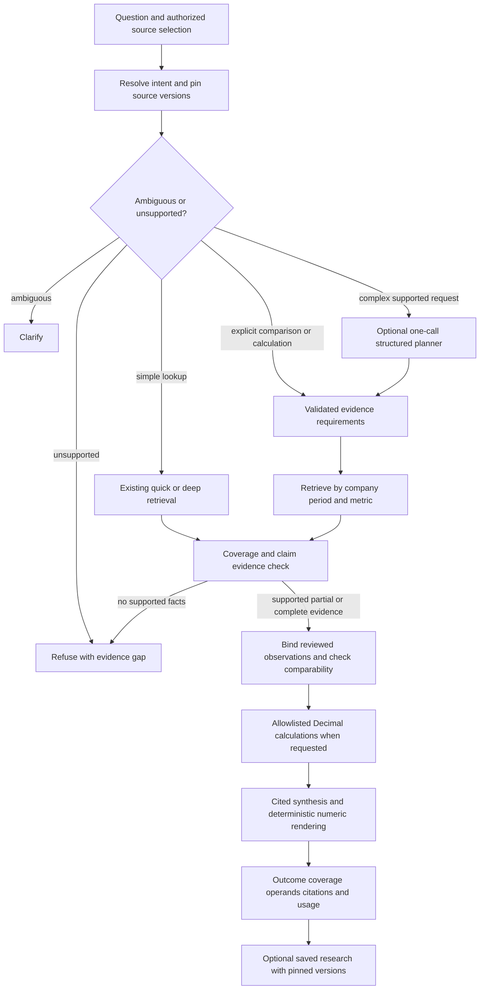

# FinRAG Phase 3: evidence-backed financial research

Planning date: October 2, 2026. Reviewed repository state: `d6a0cd1` on `main`, including the previously uncommitted financial-evidence batch validated and committed during this investigation. This is the retained proposal; implementation has since started. See [current implementation status](PHASE_3_IMPLEMENTATION.md) for contracts, original bindings, pinned research and calculation receipts, and their remaining gaps. This plan does not promote the experimental response protocol or authorize new model runs, ingestion, cloud provisioning, or scheduled source fetching.

## Recommendation

FinRAG should become a small, reproducible financial research workspace: select a collection and reporting basis, ask a question across companies or periods, inspect the required evidence and gaps, and receive a cited answer with code-calculated results. Save the research with its exact source versions so it can be reproduced after a source update.

Build trustworthy financial observations and coverage decisions before adding agent planning. Keep the existing LangGraph, source registry, private object store, parent-child retrieval, BM25 and service/API boundaries. Simple lookups should retain a direct retrieval/generation path. Complex comparisons should use a bounded evidence workflow; an optional LLM planner should propose a validated plan only when deterministic question templates cannot express the request.

The first useful release is narrow: reviewed revenue, gross-margin, segment and operating-count facts for a small pinned corpus, with explicit periods, units and citations. It should answer supported comparisons, show missing operands, and decline unsupported rankings. General financial automation is a later decision.

## Evidence that determines the order

The [phase-close report](PHASE_CLOSE_REPORT.md), [implementation status](NEXT_PHASE_PLAN.md), and immutable benchmark captures distinguish three different states:

- **Retained 30-question baseline:** strict correctness **19/30**, numeric accuracy **9/10**, clarification **0/3**, out-of-corpus refusal **4/4**, strict cross-document **1/4**. Final macro evidence recall **0.673** and complete evidence **16/26** supported questions. Receipt-repriced cost **$0.019366155**; service p95 **3.261 seconds**. [Reviewed metrics](benchmarks/20261002-parent-bm25/reviewed_summary.json), [receipted cost](benchmarks/20261002-parent-bm25/measured_cost.json).
- **Financial protocol experiments:** the intermediate [financial-answers-final capture](benchmarks/20261002-financial-answers-final/reviewed_summary.json) retained **9/10** numeric but achieved only **14/30** strict. The subsequent [quote-bound full capture](benchmarks/20261002-financial-answers-bound/reviewed_summary.json) reached **0.897** final recall and **23/26** complete evidence, but strict correctness remained **14/30** and numeric fell to **5/10**. Clarification was **3/3**, OOC refusal **4/4**, strict cross-document **2/4**, both successes being clarification cases. Fourteen supported requests refused. [Paired results](benchmarks/20261002-financial-answers-bound/paired_summary.json) list nine lost strict successes and four gains. Receipt-repriced cost **$0.029741935** (+53.6%); service p95 **3.813 seconds** (+16.9%). This profile is **held**, not promoted.
- **Final ordinary path:** the experimental original-span/quote/calculation protocol was isolated behind positive `supplement_k`; source-aware clarification and deeper semantic routing remain shared. The [final default subset](benchmarks/20261002-financial-default-final/reviewed_summary.json) is **7/12** strict, **3/3** reviewed numeric and **3/3** clarification, with one q11 wrong-period provision trend. It is a selected regression subset, not a full final-default baseline. [Post-capture changes](benchmarks/20261002-financial-answers-bound/post_capture_changes.json) preserve this distinction.

All captures above use the unchanged golden questions, label hash and three original PDF identities. Reviews are Codex source/rubric review, not independent human judging. Receipt repricing is authoritative for the stated costs; the summaries' coarse configured estimates differ. Different cache/runtime conditions and evidence budgets prevent causal speed/cost claims. Thirty questions, only four cross-document cases, do not establish general accuracy.

Concrete failure-to-work mapping:

- **q07, q15, q16:** missing Gaming/ramp/outlook passages caused baseline refusals. More evidence helps retrieval, but q07 still refuses with complete golden evidence in the bound capture. Improve passage targeting and usable facts, rather than continually enlarging context.
- **q08:** the correct annual number cited a valid title/caution card instead of its operand evidence. Citation identity is not claim support; a title quote also passes location checks without proving a number.
- **q18, q23, q24:** clarification improved, but the current heuristic is narrow. The two numerical cross-company questions require period, definition, basis and scope clarification; they are not demonstrations of successful numeric comparisons.
- **q21, q22:** segment ranking requires every segment; trend arithmetic requires both comparable periods. q22's 51% to 54% change is +3 percentage points, not a claim of 54% to 54% increasing. This motivates an operand contract and deterministic result rendering.
- **q14 and bound q13:** quarter-specific results and subsequent April developments need separate event dates. Final-default q11 shows a temporal trend error remains even outside the experimental protocol.
- **q25, q26:** distinguish a supported qualitative comparison from a common numeric AI-revenue metric. Recover AMD evidence and both risk lists; do not invent economic comparability. q26 regressed in later captures despite being the baseline's only strict cross-document success.
- **Bound q02/q03/q10 and other losses:** exact quote/label checking is too brittle to bind sparse PDF table rows and headings reliably. Complete retrieved evidence did not guarantee a usable answer. Correct row/column associations first; do not merely remove guards or accept model-declared labels.

## What is technically ready, and what needs foundations

**Ready to build on now:**

- The opt-in Postgres registry has stable source IDs, immutable content versions, raw hashes/objects, retained blocks/chunks, leased ingestion jobs and atomic build activation with last-good preservation. Confirmed company/year/quarter/document-type filters and explicit source/version filters exist. Local Chroma remains a compatibility path. [Source lifecycle](PERSISTENCE.md).
- Original evidence spans preserve version/hash, block identity, offsets and pages/lines. Original table rows survive separately from generated captions. The PDF parser retains `structured_data.rows` and table bounding boxes. These are ingredients for observations, not a verified financial fact store. [Evidence contract](EVIDENCE.md), [parser](../src/parsers/pdf_parser.py).
- The shared query graph already supports routing, structured outcomes, refusal and usage/stage traces. The persistent service creates request-specific retrievers; the APIs can expose bounded options without a new framework. [Graph](../src/pipelines/query.py), [persistent service](../src/services/persistent_service.py).
- The existing opt-in `CalculationOperand`, quote guard and `Decimal` renderer offer reusable validation/arithmetic patterns for differences, percentage-point changes and growth. Reuse them where valid; they do not yet establish semantic table binding. [Generator](../src/generators/rag_generator.py).
- Hash-bound benchmark/review replay, source-grounded labels, per-question contexts, paired deltas and token receipts already support controlled development. No corpus rebuild is necessary to inspect these failures.

**Foundation gaps that block broad financial reasoning:**

- Source metadata has one primary period; a filing/deck can contain several quarters, YTD and annual amounts. There is no fact-level period/duration model, metric dictionary, scale/currency normalization, fiscal-calendar comparability contract or verified row/column association.
- A byte version's `supersedes_version_id` is not evidence of a financial restatement. Separate filings can revise historical facts; amendment forms, accession/report lineage and metric-level revision relationships are not modeled. Historical metadata confirmation is also conservative and may not be available for a pinned version.
- `_route_after_retrieve` checks whether any chunks exist. It does not check whether every company, period, metric or operand requested is covered. Current clarification sees confirmed metadata attached to retrieved chunks, rather than a complete independently resolved collection inventory.
- A Postgres retrieval call uses one repeatable-read snapshot, but a future sequence of calls would otherwise resolve active pointers separately. A multi-source research run must pin the entire authorized version/build set at its start.
- Existing calculation labels are model-supplied strings checked for occurrence in original text. Label presence does not bind that value to a row, column, scope or period. Calculations in ordinary prose remain outside the structured envelope. General ratios, margins, unit scaling, YTD derivation and amendment selection are not implemented.
- URL bookmarks, explicit snapshots and source management exist; named collections, watchlists and persisted research runs do not. A bookmark without a successful content snapshot provides no searchable evidence.

These gaps are why an autonomous planner is not the next fix: it would plan over unverified financial semantics.

## Recommended architecture

Keep one application and database. Add small validated records and deterministic functions to the current flow; do not introduce a separate agent service, knowledge graph or search platform.

For a simple narrative lookup, observation binding/calculation is a no-op; use its original passage and normal synthesis. No planner call is added. For a simple numeric lookup, a verified observation can render the amount directly without a generation call. The coverage contract applies proportionately to both paths. A failed check must not silently fall back to an unchecked financial answer.

### Minimal records and authority

These are proposed contracts, not existing tables or APIs:

- **Research request / plan:** collection or explicit source selection, company IDs, requested metrics/scopes/bases, explicit period policy, knowledge cutoff, required evidence tasks and allowlisted operations. Exact templates resolve familiar requests deterministically; one optional structured model output can propose unresolved decomposition. Validators own authorization, supported dimensions and limits.
- **Financial observation:** immutable observation ID; company and metric ID plus original label; consolidated/segment dimensions; GAAP/non-GAAP/operating definition; value as a decimal string; currency/base unit and scale; instant date or duration start/end; fiscal label and calendar interpretation; reported/derived status; source/version/build/hash and original evidence links; verification status and extraction/review revision.
- **Evidence links:** value cell/span plus separate row-label, column-period, unit, basis and scope support. Link to exact original block/offset/page and table row/column index where available. A cell coordinate must be verifiable against retained rows; extraction uncertainty remains unverified. Permit manual reviewed bindings for a small difficult-table corpus, and label that ceiling honestly.
- **Coverage result:** one status for each company × period × metric/scope task: supported, ambiguous, source absent, source unavailable/failed, passage not found, binding unverified, non-comparable or conflicting. Store the evidence references and reason, not a confidence number invented from similarity.
- **Calculation receipt:** operation and version, all input observation IDs/evidence links, normalized operands, formula, unrounded decimal result, displayed precision/rounding and output unit. The result is derived evidence; its original authority is the complete operand chain.
- **Saved research:** original question, resolved plan, source/version/build manifest, observation/review revisions, coverage, calculation receipts, answer/citations, code/model/configuration hashes, usage and timestamp. Start with a JSON export; add owner-scoped persistence when repeated research warrants it.

Reuse source/version/block IDs. Store reviewed observations as a small derived sidecar keyed to version/build first; add a relational observation table when querying/persistence needs it. Do not change chunk IDs, raw originals or embedding inputs just to add financial annotations. New fact extraction revisions must not overwrite prior saved research. Confirmed metadata and reviewed originals outrank suggestions; generated captions never become operand evidence.

### Multi-document coverage and missing evidence

Resolve the requested companies and allowed source inventory before retrieval. Pin authorized versions/builds once, then retrieve separately for each required company/period/metric task; deterministic allocation prevents one company from consuming the entire context budget. Merge/deduplicate by original identity and retain a coverage matrix. Finding one chunk per company is insufficient when several metrics or periods are requested.

An answer requires all evidence needed for its assertions. A ranking requires every candidate and a comparable metric; missing one operand blocks the ranking. A supported partial question can return `qualified_answer` with the unanswered rows and reasons, never a zero-filled comparison. Refuse when no requested fact is supported. Clarify when the user must choose period, scope, definition or revision policy; absence of a specified quarter is missing data, not ambiguity. Non-comparable facts may be described separately with their units and limitations, without ranking.

Distinguish not in the collection, a failed snapshot, a retrieval miss and an unverified table binding. A negative retrieval result cannot prove the company never disclosed a metric. Preserve conflicting facts as separate candidates; resolve only through verified revision lineage or report the conflict with both citations. An optional model entailment check may aid review, but cannot certify numerical bindings or overrule a failed deterministic gate.

### Temporal selection and revisions

Treat **reporting time**, **publication/filing time**, **local ingestion time**, and **event time** separately. Default research uses the latest reviewed evidence available within the selected collection and reports that boundary; it must not imply current market coverage. An explicit historical knowledge cutoff excludes later publications even when they describe an earlier quarter. Local ingestion timestamps do not establish what was publicly known then.

Each observation carries an instant or duration, actual dates and original fiscal label. `Q1 2026` is not a universal calendar interval. Compare quarter with quarter, YTD with the same cumulative duration, annual with annual, and stock values at specified instants. Unequal fiscal calendars/52–53-week years require an explicit comparison policy and disclosure; do not silently treat fiscal labels as equal dates. Quarter-specific synthesis excludes later events unless presented separately as subsequent context. Interim income statements can present both quarter and YTD, while cash-flow statements commonly cover YTD; this explains why document-level quarter metadata cannot identify an operand's scope. [Regulation S-X 10-01(c)](https://www.ecfr.gov/current/title-17/chapter-II/part-210/section-210.10-01).

Model amendments/revisions by report identity (issuer, reporting interval, form/accession where available) and evidence-backed fact lineage, separate from raw content updates. Preserve as originally reported and latest reviewed restated observations. For current research prefer the latest reviewed revision that actually applies to the requested fact; for as-of research use only versions known by the cutoff. A `10-Q/A` or newer deck is not blanket replacement evidence. If revision relationships or metadata are unresolved, show both and block the derived comparison. Basis or segment reclassification can make a historical series non-comparable even when the amounts are individually verified.

Start with explicit reported quarterly/YTD/annual values. Later, derive an additive quarter flow from consistent YTD differences, or Q4 from annual minus nine-month YTD, only when periods, definitions, revisions and units align; cite both inputs. Never subtract EPS, margins, ratios or stock balances to infer a quarter metric. Trailing-twelve-month aggregation belongs after these rules pass evaluation.

### Deterministic calculations

Use the existing Python `Decimal` approach, with decimal-string input, explicit scale factors and no binary-float intermediates. Keep full internal precision and round only for display under a versioned policy. Parentheses/negative amounts, separators, percentage notation, thousands/millions/billions and operating units need tested parsing; blank/dash/not-disclosed cells remain missing unless the original explicitly defines zero. An additive zero can be valid; an absent operand cannot.

Start with a short operation allowlist:

- Difference: `end - start`, with matching metric/definition or an explicit valid same-period operation such as production minus deliveries.
- Relative growth: `(end - start) / start * 100`, for a positive baseline; zero/negative baselines produce an absolute change and explanation rather than a misleading conventional growth percentage.
- Percentage-point change: end percent minus start percent. For 51% to 54%, display **+3 percentage points**; relative growth of that rate is a different request.
- Margin: `verified profit / corresponding revenue * 100`, with the specific profit definition, same entity/scope/basis/duration and nonzero revenue. A reported margin is a separate observed fact, not automatically equivalent to a reconstructed rounded ratio.
- Named ratios: numerator/denominator with operation-specific dimension checks; reject zero denominators and invalid mixed periods. Add only ratios supported by evaluation cases.

Each operation has its own compatibility checks. Growth normally keeps the same company and metric across periods; an explicitly requested cross-company difference can use two companies when definitions and intervals are comparable. A margin uses different numerator/denominator metrics, so the prototype's generic same-label checks cannot simply be extended to every operation. Currency scale conversion is deterministic; cross-currency comparison is blocked until a cited exchange-rate policy exists. Qualify bank versus industrial-company revenue or margin definitions instead of assuming identical economics.

The LLM may propose candidate facts and explain disclosed drivers. Code validates observed inputs, chooses allowed formulas, calculates, attaches every operand citation and renders numeric claims. For a calculated request, synthesize from accepted facts/results rather than unrestricted model arithmetic; reject unsupported numeric additions and contradictory trend statements. Deterministic validation proves identity/dimensions/arithmetic; qualitative entailment and causation still require source/rubric review.

### Bounded planning in the existing LangGraph

**Yes, eventually add a planning branch; no, do not route every question through an agent.** Extend `QueryState` with a validated plan, pinned corpus manifest, coverage and calculation receipts. Reuse current retriever/service boundaries while adding filter/task selection. LangGraph already supports fixed routing workflows; the distinction between predetermined workflows and dynamic agents supports keeping deterministic execution around an optional planner. [Official LangGraph guidance](https://docs.langchain.com/oss/python/langgraph/workflows-agents).

Initial proposed hard bounds: at most **one planner call**, **six evidence tasks total**, **two retrieval attempts per task** (a primary query and one targeted repair), **three companies**, **three reporting periods**, and **one synthesis call**. Use one shared **6,000-token original-evidence ceiling** for the planned-path comparison experiments, allocating per-task minimum coverage before extra context; this is a new proposed policy, not the historical 2,400-token contextual retrieval gate. Define a request deadline/token ceiling before capture. Exceeding bounds asks the user to narrow the question; it must not silently drop a required task. Reuse identical query embeddings where safe. Keep execution sequential initially; concurrency waits for measured latency need and snapshot tests.

Planner output contains tasks/operations and short reasons, never authoritative financial values. Validate all identifiers against the pinned authorized collection. No arbitrary SQL, Python execution, browser, unapproved source fetching, corpus mutations or recursive planning. A repair retrieves missing evidence; it cannot invent an operand, change a requested quarter or reinterpret an unsupported definition. Deadline/repair exhaustion returns explicit gaps. Measure plan validity, required-task recall, bounded completion and extra cost independently from answer accuracy.

Enable the branch only when it beats deterministic decomposition on held-out multi-hop questions. If templates plus targeted retrieval solve the evaluation, leave the LLM planner disabled.

## Business and research workflow

**Build next:** extend the existing source-selection workflow with a visible inventory of confirmed companies, periods, document types, active version and missing review. Use existing bookmark registration and explicit snapshot refresh. Record a selection manifest even before named collections exist. Do not add a new upload/index lifecycle.

**Prepare now / build later:** owner-scoped collections reference stable source IDs and store intended company/period coverage. A watchlist is initially a saved company/source selection, not a scheduled crawler. Saved research pins versions and distinguishes a historical run from a new rerun. Source update shows changed bytes, metadata review needs and affected saved runs; a failed refresh retains active last-good evidence. A new version marks research as potentially stale, never silently edits its past answer. Add semantic material-change summaries only after deterministic change detection and cited before/after facts work.

**AI judgment that adds value:** resolving natural-language intent beyond templates, proposing supported metric aliases, extracting candidate narrative drivers, comparing disclosed risks, and summarizing verified changes with evidence. Require review for ambiguous metadata or observation bindings. AI should not allocate canonical identity, approve amendment lineage, pick hidden fiscal assumptions, decide access, mark unsupported evidence covered, compute arithmetic or promise current completeness.

**Later data-source option:** a small SEC submissions/XBRL adapter could complement PDFs for standardized consolidated facts; store accession, context dates, units and original filing links through the existing registry. The SEC aggregation APIs cover standard-taxonomy entity-wide facts, so they cannot replace segment/custom/non-GAAP evidence. Calendar frames select the last-filed closest calendar-period fact and may mix reporting dates; do not use a frame as the automatic fiscal-quarter/as-of selector. Pilot company facts plus original filings only after the observation contract exists. [SEC API documentation](https://www.sec.gov/search-filings/edgar-application-programming-interfaces).

## Six milestones and dependencies

Each milestone is a meaningful completed batch with focused offline tests, updated evidence/docs and a clean commit/push on the current repo/main when reasonable. Preserve the user's lightweight workflow; no branch/PR redesign is part of Phase 3. Paid evaluation and new corpus ingestion require a separately agreed bounded experiment; estimates below indicate relative scope, not delivery dates.

### M1 — Freeze financial contracts and evaluation design (build next; small)

Define request/outcome, observation, period/revision, coverage and calculation contracts with examples from q07/q08/q14/q18/q21–q26. Inventory known source metadata and unresolved table bindings. Freeze a development/holdout design before prompt or planner tuning. Reuse saved contexts for diagnostics.

Before claiming current-default improvement, capture a full paired 30-question run of the final ordinary path, with a preapproved budget; the selected 12 questions cannot supply that baseline. Keep the historical 30 and labels immutable. No live recapture is part of this planning pass.

Exit: every baseline failure maps to a labeled defect and contract requirement; ambiguity versus missing evidence has explicit examples; test/corpus split and cost policy are frozen. Dependencies: existing registry/evidence/replay only. Prepare collection and saved-run identities here without building their UI.

### M2 — Verified observations and temporal/version selection (build next; medium)

Bind retained original table values to row labels, period columns, units and scope. Start with reviewed revenue/gross-margin/segment/operating-count observations in the three existing PDFs; manual original-page review is acceptable and explicitly measured. Add versioned metadata corrections for pinned historical versions without changing raw snapshots. Implement deterministic date/scope/basis/revision selection and conflict/missing statuses.

Prepare a small additional corpus of roughly 12–18 reports across at least three companies, three successive quarters plus an annual report and at least one verified amendment/restatement or reclassification example. Prefer official filings and original releases; ingest only the missing documents in a bounded later task. The current three-PDF corpus cannot establish cross-quarter/amendment reliability. Where no authentic fixture is available, label synthetic cases separately and do not claim real filing coverage.

Exit: all promoted numeric observations have independently reviewed value/label/column/unit/period links; selection never silently substitutes quarter/YTD/annual, active/historical version or accounting basis; failed refresh and unresolved revision tests preserve last-good data. Dependencies: M1. Deliverable: inspectable fact/period cards, not a universal financial parser.

### M3 — Cited calculation receipts (build next after M2; small to medium)

Extend/reuse the current Decimal validator for the allowlisted operations and normalized units. Separate candidate extraction from accepted operand binding; permit different evidence spans for row, column and unit support. Render verified results and direction deterministically, expose both input citations and formula. Reject missing, non-comparable, nonfinite and zero-denominator inputs. Add YTD-derived additive quarter flows only after the basic checks pass.

Exit: exact expected results/rounding and every operand citation pass offline fixtures; q08's numeric provenance and q22's trend have reproducible receipts; unsupported prose arithmetic cannot pass the calculated-answer path. Dependencies: M2; evaluation/contracts from M1. This milestone does not claim all narrative answers are verified.

### M4 — Multi-document and cross-quarter coverage workflow (build next after M2/M3; medium)

Deterministically decompose explicit comparisons, trends and rankings. Pin the complete authorized source/version/build manifest once and retrieve by task. Check coverage/comparability before calculating or synthesizing, support honest partial answers, and present gaps/conflicts. Keep ordinary lookups on the simple path. Add a request trace showing requirements → evidence → operands → result.

Exit: q18/q23/q24 clarify, q25 preserves non-comparability and all supported company evidence, q26 retains both risk sources; new complete comparisons pass with every requested cell supported. Missing-company/quarter/segment cases never create full rankings. Cross-call updates cannot mix source snapshots, and owner/archive checks remain enforced. Dependencies: M2 for qualitative coverage, M3 for calculated comparisons. First valuable research demo ships here if evaluation gates pass.

### M5 — Optional bounded planning experiment (prepare now / build later; medium)

Compare deterministic M4 decomposition with one structured planner for heterogeneous multi-step narrative requests. Add only the branch and validators in the existing graph; reuse task retrieval, coverage and calculation functions. Benchmark incomplete/malicious plans and bounded exhaustion.

Exit: at least three additional strict successes on the 48-question frozen holdout compared with M4, no formerly correct case lost, all hard safety/coverage gates retained, and cost/latency within the predeclared planned-path allowance. Three cases are a practical decision threshold, not statistical proof. If no gain, keep M4 and do not ship the planner. Dependencies: M4 and a sealed M1 holdout; planner never compensates for unverified M2 facts.

### M6 — Reproducible research workspace and release decision (prepare now / build later; medium)

Add named collections/watchlists over existing source IDs, saved research export/persistence, version-change/staleness indicators and explicit rerun. A small UI shows coverage, periods, cited operands and saved history. Manual refresh comes first; scheduled updates require a separate usage/reliability decision. The workspace can ship on M4 without M5 if the planner is unjustified.

Exit: reopen a saved answer with identical pinned evidence/results after a source update; create a separate rerun/diff; failed source refresh leaves both prior retrieval and saved history intact; full quality gates and focused lifecycle/API tests pass. Publish an honest measured demo and limitations. Dependencies: M4; collection identity prepared in M1; M5 optional. Cloud deployment and sustained capacity testing remain a separate release task.

Dependency summary: **M1 → M2 → M3 → M4 → M6**; M4's qualitative coverage can begin once M2 is ready. **M4 → optional M5 → M6** only if the planner experiment passes. Evaluation runs throughout; UI breadth cannot unblock missing financial foundations.

## Evaluation and proposed promotion gates

### Expand coverage without moving the old goalposts

Keep the historical 30 as a frozen regression screen. Add a separately versioned **96-question Phase 3 set**: six primary slices of 16 each, split **8 development / 8 holdout per slice** (48/48). Split by report family/company-period/revision lineage so development does not leak the same table or amendment into holdout. If the initial corpus cannot support this separation, collect more evidence or reduce the advertised scope; do not make a random near-duplicate split. Each question has one primary slice and optional cross-tags:

- Multi-document coverage: two/three-company qualitative and numeric comparisons, complete rankings, one-company dominance in retrieval, and a requested source not in the selection.
- Temporal/scope: QoQ/YoY, fiscal/calendar disagreement, quarter/YTD/annual, instant/duration, unequal quarter lengths, post-quarter events and segment/consolidated/GAAP distinctions.
- Calculations/units: delta/growth/percentage points/margin/ratio, unit scales, negative/zero bases, rounded source figures and additive quarter derivation with all operands.
- Clarification: unresolved period, basis, metric definition, latest/common period, ambiguous aliases and explicit questions that must not be unnecessarily clarified.
- Conflicts/revisions: original versus amendment, revised historical comparatives, metadata corrections, conflicting releases, changed segment definitions and as-of cutoffs.
- Missing evidence: missing quarter/company/operand, failed snapshot, unverified table, irrelevant retrieved chunks, generated-only evidence and out-of-corpus requests.

Require at least **20 numeric/calculated holdout questions** through cross-tags. Freeze labels, exact source hashes/locators, periods, definitions, expected outcomes, required observations/operands, calculation result/tolerance, evidence gaps and semantic rubric before inspecting experiment answers. Use authentic source cases for release claims; separately reported synthetic adversarial/unit cases can exercise failures but cannot inflate authentic accuracy. A human second review of release-critical numeric/revision labels is recommended; until available, disclose Codex review and do not claim independent judging.

### Stage-specific checks

- **Offline contract checks:** exact period/version/alias selection, authorized pinned snapshots, table binding, unit parsing, operation-specific compatibility, expected Decimal results, missing/conflict behavior, refusal/clarification formatting, planner bounds and saved-run replay. Extend existing focused pytest checks; no paid tests in CI.
- **Evidence retrieval:** per-task recall, full company/period/metric coverage, complete-question evidence and relevant original-token use. Report candidate and final recall separately. Measure observation extraction precision and recall against reviewed facts, not merely quote location.
- **Answer review:** strict correctness and rubric completeness, numeric identity/value/tolerance, every claim's issued-citation support, operand linkage, comparison validity, wrong-period/scope claims, unsupported assertions, clarification/refusal accuracy and false refusals on supported cases. Coverage status correctness is a separate metric. Omit undefined metrics rather than invent a zero/pass.
- **Operational receipts:** plan validity/task recall, task/repair counts, stage/end-to-end p50/p95, generator/planner/embedding calls, original context tokens, input/completion/reasoning/cache usage, priced/unknown cost denominators, and failed-run expenditure. Cost uses full receipt repricing, not the coarse application estimate.

### Proposed gates before changing defaults

These are new **Phase 3 proposals**, to be frozen in M1 before implementation. Existing [contextual-retrieval promotion gates](BENCHMARK.md) stay unchanged. Their requirement for two more numeric successes cannot be met on a 9/10 baseline; the old arm remains held. Do not relax it retroactively or claim Phase 3 bypasses it. A future retrieval promotion needs a separately approved, sufficiently large paired evaluation and its own predeclared gate.

- **Historical screen:** preserve all 19 historically strict successes, obtain at least **24/30** strict, retain **at least 9/10** numeric with no previously correct numeric case lost, **3/3** clarification and **4/4** OOC refusal. Require **4/4** strict cross-document outcomes; report that two are clarification questions, so this alone does not prove calculation quality.
- **Safety across regression and authentic holdout:** **zero** unsupported financial assertions, wrong-period/scope substitutions, invalid citations, missing operand citations, unauthorized-source use or full rankings with missing/non-comparable cells. All labeled critical missing/conflict/revision cases must choose the correct safe outcome. A fabricated answer cannot be offset by more successes elsewhere.
- **Expanded holdout:** at least **41/48** strict (85.4%), at least **7/8** in every primary slice; numeric/calculated accuracy **≥95%** over the frozen numeric denominator (at least 20); complete required evidence **≥90%** on answerable tasks, and **100%** complete operand coverage for every calculation actually issued. Clarification/missing/conflict cases are scored on correct outcome and gaps, not on retrieving nonexistent operands. Every numeric fact used must have a verified binding; abstentions count against answer correctness/recall so safety cannot hide unusability.
- **No simple-path tax:** no planner on supported ordinary lookups; matched simple-path mean cost and p95 latency rise by at most **20%** against a newly measured current-default baseline. Target at most one generation call, with zero calls for deterministic clarified/refused/rendered cases.
- **Complex path:** predeclare a separate budget before capture. Initial proposed allowance is mean receipt cost **≤1.5×** and service p95 **≤1.5×** the deterministic M4 path on the same questions, with the one-planner/six-task/two-attempt/6,000-token limits. Promote planning only with M5's extra strict successes. Do not compare complex runs to unrelated quick-lookup averages. Cost or usage gaps mean the gate is unassessable and remains held.
- **Controlled experiments:** freeze corpus, labels, snapshot/version policy, model and review policy; use the same original-evidence budget and cache mode for both arms. Compare one variable at a time, publish paired wins/losses and denominators, and investigate every regression. Repeat only when stochastic uncertainty affects a promotion decision. Any use of holdout failures for tuning requires a new sealed holdout before another promotion claim.

These thresholds define a narrow release decision, not a production accuracy guarantee. Keep the last-good path until all applicable gates pass. An opt-in experiment can remain available with an explicit hold status.

## Interview and portfolio value

Priority order, based on demonstrated failures rather than feature labels:

1. **A reproducible cited calculation:** show the row/period/unit bindings, original inputs, Decimal formula and correctly rendered delta/margin. Contrast q08/q22 failures with measured corrections and missing-input abstention. This demonstrates domain modeling, data provenance and reliable code/LLM boundaries.
2. **A complete multi-company/cross-quarter research trace:** display required cells, verified versus missing coverage, comparable definitions and both operand citations. Include one intentionally incomplete and one conflicting/restated example. This shows useful reasoning beyond single-document retrieval.
3. **An honest evaluation and failure story:** retain failed experiments, explain why 0.897 recall did not improve strict accuracy, publish regression/holdout and measured cost/latency. This is stronger evidence of engineering judgment than an unqualified accuracy headline.
4. **Saved research with version-aware updates:** reproduce the old result, flag an affected run, and create a cited rerun/diff after a source update without deleting history. This makes the architecture useful to an analyst and demonstrates lifecycle reliability.
5. **Conditional bounded planning:** show where templates stop, why one validated planner call helps, and its measured gain/ceiling. Portfolio value is conditional on M5 results; an agent badge alone adds little.

The best first demo is M2–M4 plus evaluation, not a broad workspace redesign. Describe local Docker evidence as local; no new cloud SLA or deployment claim follows from this plan.

## Defer or avoid

**Prepare now / build later:** SEC structured-fact pilot; verified additive YTD/Q4/TTM derivations; named collections and saved research; human observation/revision review; material-change summaries; bounded planner evaluation. Keep contracts compatible with these without implementing speculative adapters or tables.

**Not justified yet:** autonomous browsing/crawling, scheduled watchlist refresh, general tool-using agents, recursive planner/reviewer loops, multiple agent roles, arbitrary model-written code/SQL, agent framework migration, extra vector/search services, fine-tuning, broad knowledge graphs, contextual re-embedding/reranking without a new measured need, real-time price feeds, FX conversion, universal ratio catalogs, valuation/trading recommendations, automatic causal forecasts, and public multi-tenant product/auth expansion. They add cost or authority beyond the present evidence and evaluation.

Avoid large context as the default remedy, treating quote matches as semantic support, treating all new filings as restatements, mixing calendar/fiscal or quarter/YTD values, ranking incomplete companies, overwriting saved research, and relabeling benchmark answers after a failed run. Preserve last-good data, unknown states and original evidence throughout.

## Investigation validation and references

This planning pass inspected the current registry/models/schema, retained table representation, shared LangGraph, generator/Decimal/citation guards, persistent retrieval/service adapters and benchmark contracts. It reused saved captures; no application code was added or changed by the planning pass. The separately authorized existing batch was committed first.

Publication checks: **58 relevant tests passed**, covering generator/query/retrieval, service, answer-review/benchmark replay, usage, private-runtime contracts and API. Offline replay reproduced the baseline and four reviewed successor captures and their receipt costs; three successor manifests retain the baseline golden/label/corpus identities. No ingestion, embedding, generator/judge call, full pipeline, fresh Docker build/restore, cloud provisioning or CI monitoring was needed. Historical database/Docker receipts remain historical evidence, not checks rerun here.

Primary research consulted October 2, 2026: [SEC EDGAR data APIs](https://www.sec.gov/search-filings/edgar-application-programming-interfaces), [Regulation S-X interim reporting](https://www.ecfr.gov/current/title-17/chapter-II/part-210/section-210.10-01), and [LangGraph workflows/agents](https://docs.langchain.com/oss/python/langgraph/workflows-agents). Their documented capabilities inform the design; the roadmap, bounds and gates are engineering proposals rather than measured Phase 3 behavior.
