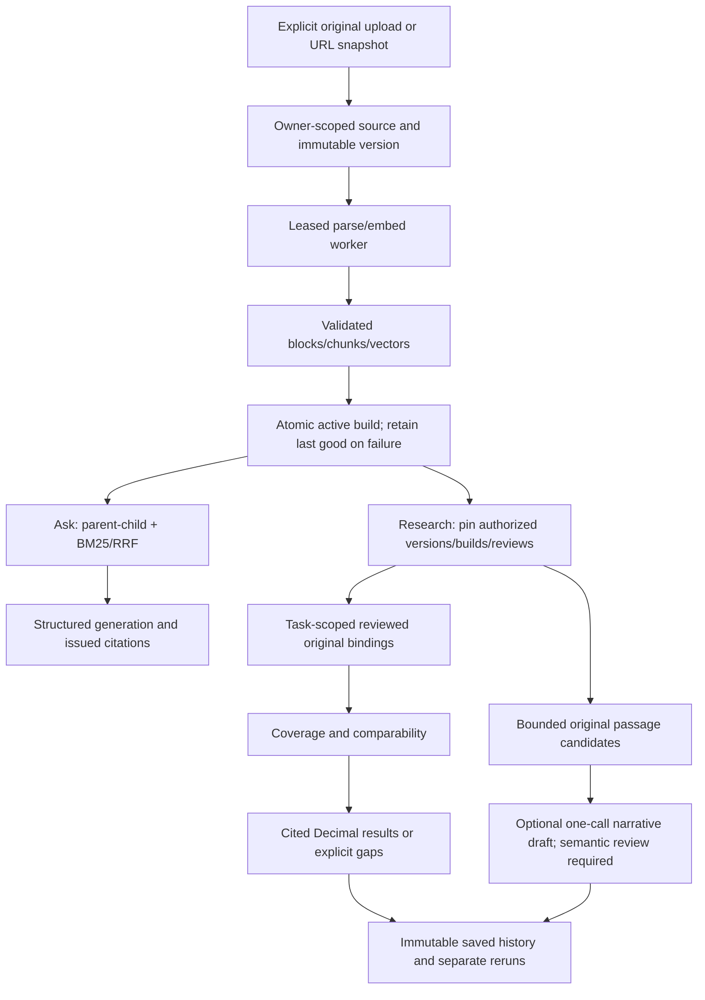

# Current architecture

[STATE](../STATE.md) describes current readiness. The application retains two runtime profiles: Postgres-backed research when `DATABASE_URL` is configured, and the notebook/local Chroma compatibility path otherwise. Both reuse the ingestion/query components; no planner is enabled.

Raw objects live in private local storage or the S3 adapter. Postgres owns registry identity, metadata review, jobs, original blocks, relational parents/children, pgvector embeddings, fact cards, collections and saved runs. Exact vector search plus BM25 is the retained default. Versions/builds are published only after validation; a failed refresh retains last-good evidence. Generated captions/context are derived retrieval aids, never authoritative operand evidence.

Research loads only matching cards and their original role blocks for numeric tasks, after pinning the selected inventory. It preserves conflicts/revision predecessors before the 100-card limit. Passage/Ask retrieval retains the 10,000-child selected-corpus bound. Research requests allow at most 18 sources, six tasks, three companies and three periods; passage tasks allow two attempts, three anchors and a shared 6,000-token original budget. Immediate same-page original neighbors preserve headings/context and separate locators. Limits bound execution; they do not certify financial meaning.

| Responsible code | Boundary |
| --- | --- |
| [Persistent service](../../src/services/persistent_service.py) / [registry](../../src/storage/registry.py) | Owner-scoped lifecycle, snapshots, reviewed facts and saved history |
| [Local service](../../src/services/rag_service.py) | Chroma compatibility orchestration |
| [Query graph](../../src/pipelines/query.py) / [generator](../../src/generators/rag_generator.py) | Ask routing/outcomes and bounded generation |
| [Financial modules](../../src/financial/) | Intent, bindings, temporal selection, coverage, Decimal calculations, original search and drafting |
| [Private API](../../src/api/private_server.py) | Authenticated single-owner routes; no request-supplied owner |
| [Streamlit](../../app/streamlit_app.py) / [research view](../../app/research_workspace.py) | Trusted local Research/Library/History/Ask and owner administration |
| [Source CLI](../../scripts/sources.py) | Explicit migration, registration, snapshot, worker, query and archive |

Without `DATABASE_URL`, the local service uses parsed content caches, Chroma child vectors, in-memory BM25 and saved parent/child artifacts. Historical artifacts without original/embedding provenance remain migration-required; do not invent model identity from dimensions or relabel legacy chunks. [Evidence/migration](../EVIDENCE.md), [persistence/API/restore](../PERSISTENCE.md), [research routes](RESEARCH.md).

Evaluation remains offline and separately budgeted. Receipts isolate request usage, keep unknown values unknown and avoid counting reasoning twice. Optional tracing needs an explicit retention/access decision. The private image omits Streamlit/notebook/Chroma packages; earlier Docker validation is local Linux/arm64 evidence, while cloud and expanded-process capacity are deferred. [Usage](../USAGE.md), [private profile](../PRIVATE_DEPLOYMENT.md).
