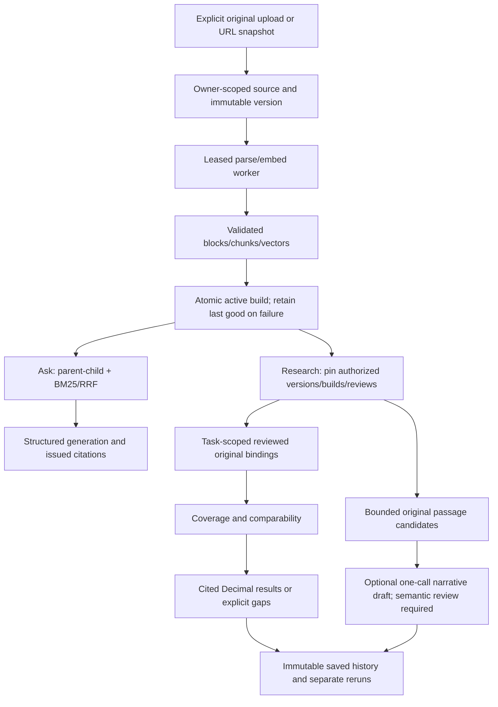

# System knowledge

[STATE](../STATE.md) owns readiness. With `DATABASE_URL`, the existing service/graph/private API/local UI use Postgres-backed research; without it, notebooks and local Ask use the Chroma compatibility service. Both share ingestion/query components. The planner is disabled.



Raw objects live in private local storage or the S3 adapter. Postgres owns registry identity, metadata review, jobs, original blocks, relational parents/children, pgvector embeddings, fact cards, collections and saved runs. Exact vector search plus BM25 is the retained default. Versions/builds are published only after validation; a failed refresh retains last-good evidence. Generated captions/context are derived retrieval aids, never authoritative operand evidence.

Research loads only matching cards and their original role blocks for numeric tasks, after pinning the selected inventory. It preserves conflicts/revision predecessors before the 100-card limit. Passage/Ask retrieval retains the 10,000-child selected-corpus bound. Research requests allow at most 18 sources, six tasks, three companies and three periods; passage tasks allow two attempts, three anchors and a shared 6,000-token original budget. Immediate same-page original neighbors preserve headings/context and separate locators. Limits bound execution; they do not certify financial meaning.

| Responsible code | Boundary |
| --- | --- |
| [Persistent service](../../src/services/persistent_service.py) / [registry](../../src/storage/registry.py) | Owner-scoped lifecycle, snapshots, reviewed facts and saved history |
| [Local service](../../src/services/rag_service.py) | Chroma compatibility orchestration |
| [Query graph](../../src/pipelines/query.py) / [generator](../../src/generators/rag_generator.py) | Ask routing/outcomes and bounded generation |
| [Financial modules](../../src/financial) | Intent, bindings, temporal selection, coverage, Decimal calculations, original search and drafting |
| [Private API](../../src/api/private_server.py) | Authenticated single-owner routes; no request-supplied owner |
| [Streamlit](../../app/streamlit_app.py) / [research view](../../app/research_workspace.py) | Trusted local Research/Library/History/Ask and owner administration |
| [Source CLI](../../scripts/sources.py) | Explicit migration, registration, snapshot, worker, query and archive |


## Identity, metadata and lifecycle

Registration creates a stable source UUID and does no parsing, embedding or URL fetching. Supported kinds are PDF, UTF-8 text, Markdown and URL. Titles never deduplicate sources. A repeated owner/request key returns the same source only when the immutable original registration fingerprint agrees; conflicting reuse is rejected. Later metadata confirmation cannot break a retry or be overwritten by it. Early prototype rows without a fingerprint bind their first compatible retry while preserving existing metadata. Display filenames are reduced to their basename and never serve as filesystem paths or storage keys.

Raw bytes are stored at `SHA256(owner)/SHA256(bytes)` in a private object directory or S3-compatible bucket. Objects validate their hash on reading; identical bytes in one authorized scope share a blob but retain separate registered source IDs. `FINRAG_BUCKET` selects the S3 adapter; otherwise `FINRAG_OBJECT_DIR` selects a private local object directory. Local objects are the development/restore reference; a disposable cloud filesystem requires private object storage. Writes that precede a failed SQL transaction can leave unreferenced objects. Retain them for a seven-day grace period and inspect SQL references before operator cleanup; there is no automatic object deletion.

Versions have monotonic numbers, complete content hashes, raw media/size/provenance, original metadata snapshots and supersession links. Retrying unchanged bytes/configuration reuses the version/build/job. The build manifest pins embedding model/dimensions/distance, parser configuration and derived-code hash, captioner, chunk sizes/overlap, PDF page cap/range and evidence revision. It never infers an embedding model from vector dimensions.

Document-cache keys include loader/parser/captioner classes, public scalar settings and their source-code hashes. Older cache entries without this configuration are reparsed; matching text/model embedding caches remain reusable.

A leased job parses and embeds outside SQL transactions, validates the complete evidence/chunk/vector set, then publishes all derived rows and active pointers in one transaction. Publication checks the current lease; archive or a newer requested build wins over a late worker. One source update preserves the other sources. Errors record the failing stage/exception class and usage, and keep the previous active build searchable. A 15-minute expired lease can be reclaimed; completed jobs are idempotent. `scripts/sources.py worker` processes one eligible job, or accepts `--job-id` for an explicit retry. It never spins indefinitely or retries failed jobs automatically. The worker must use the same manifest configuration as the submission.

Company, fiscal period and business document type are explicit metadata, separate from format. Unknown remains null/unknown. Financial filters require `review_status=confirmed`. A different content version preserves field values but marks its snapshot as needing review; publishing it requires re-confirmation for financial filtering unless the user explicitly updated metadata after submission. A failed refresh does not remove the old confirmed active metadata. Historical explicit-version filters use the latest confirmed append-only version metadata review, falling back to the immutable registration-time snapshot. A review requires the exact source/version, reviewer and reason; it preserves raw bytes and previous metadata. Current source corrections remain authoritative for the active source. Research may pin a metadata review ID alongside version/build IDs; it never borrows another version's quarter. See [Phase 3 research](SYSTEM.md).

`POST /sources/{id}/suggestions` first resolves explicit flat front-matter field labels without a model, then invokes Luna for remaining unresolved company name/year/quarter/document type, validates supporting original block quotes and caches the result by input/model/prompt/current metadata. It returns a version ID for review and never merges sources, supplies a canonical company ID, or changes confirmed fields. A confirmed metadata snapshot skips the model entirely. Six synthetic labeled cases and abstention results are saved in `METADATA_CHECK.json`; these are a smoke screen, not a financial metadata accuracy guarantee.

## Source handling and evidence

Text/Markdown use strict UTF-8, reject NUL/empty/oversize input, preserve Markdown heading paths and exact original line offsets, and need no PDF parser/VLM/classification call. Static HTML removes script/style content; lines refer to the extracted snapshot text, whose raw HTML remains downloadable. Dynamic rendering, crawling, login pages and remote subresources are outside this adapter.

A URL registration is a bookmark, with no searchable content. Explicit snapshot fetching permits standard-port HTTP(S), checks every DNS result and redirect for non-public addresses, pins the actual connection to a checked address, retains TLS hostname verification, and caps DNS timeout, transfer deadline, redirects and raw bytes. Unsupported/compressed media fail clearly. Original/final URL, retrieval time, ETag/Last-Modified and hash are retained. Same-byte snapshots incur no new build; fetch failures retain active content. Fetching makes no browser or model call.

Retrieval resolves owner, active source/version/build and confirmed business filters in a repeatable-read SQL snapshot before vector/lexical fusion. Exact cosine pgvector search and relational parents require compatible model/dimensions/input hashes. BM25 remains the compatibility default, with a hard 10,000-child corpus limit. PostgreSQL GIN-backed `simple` text search/`ts_rank_cd` is a measured opt-in branch, not a claim of BM25 equivalence. Archive immediately excludes a source, including explicitly requested historical versions. Citations retain source UUID, immutable content hash, version UUID, block offsets, pages/lines and original evidence. Retrieved cards do not become answer citations. Confirmed business metadata is attached only to request-local chunk copies from the same authorized source/version snapshot; explicit historical versions use reviewed version metadata when available. Stored evidence is not rewritten.

## API, UI and migration

Set `DATABASE_URL` and a random `FINRAG_API_TOKEN` of at least 24 characters to select the private API from `src.api.server`. The private image starts `src.api.private_server:build_private_app --factory` and fails closed when credentials are missing. All endpoints, including health, require `Authorization: Bearer TOKEN`.

- `POST/GET /sources`; `GET /sources/{id}` and `/versions`.
- `PATCH /sources/{id}/metadata` confirms a complete validated metadata object; `DELETE /sources/{id}` archives.
- `POST /sources/{id}/content` accepts raw bytes with the appropriate Content-Type and returns a durable job ID. A separate worker processes it.
- `POST /sources/{id}/snapshot` captures/queues a URL snapshot; `GET /jobs/{id}` exposes status/attempts/error/usage.
- `GET /sources/{id}/versions/{version_id}/raw` returns an authorized attachment with no-store/nosniff headers.
- `POST /query` accepts `question`, optional `filters` (source/version/company/year/quarter/document type) optional verification and `supplement_k` (strict integer 0–8, default 0). Positive values enable the experimental bounded-parent evidence and quote/calculation response profile; it is not promoted for default use.

There is no arbitrary-server-path `/ingest` endpoint in the private app. Streamlit with `DATABASE_URL` opens Research and exposes Library, History and Ask. Registration, upload/refresh, metadata editing, archive and reviewed fact import live under Owner administration; Ask has a separate source selector. Keep Streamlit local or behind an authenticated SSH/private proxy; bearer authorization belongs to the API profile.

`scripts/migrate_index.py --output /tmp/migration-map.json` registers the raw PDFs explicitly and saves an old document-ID → source/version/hash mapping after each completed source. It reuses local vectors only when the saved model, evidence revision, vector dimensions and exact embedding inputs all agree. The existing pre-foundation index lacks model provenance, so its vectors require a bounded rebuild from raw PDFs and valid embedding caches. Trusted local pickle import is never exposed to uploads. The original local index is not overwritten.


## Review and evidence authority

A submitted `reviewed` observation with a named `review_revision` is a manual semantic attestation of metric, row/column, dates, scope and basis. Code validates authorized originals, location, amount and units; it does not certify semantic meaning. Unreviewed/unresolved observations cannot authorize numeric answers. The 168 development cards carry named Codex review; independent release review is still required.

Original passage search returns `binding_unverified` candidates by default. Optional **Draft a cited narrative** makes at most one generator call (60-second timeout, no retries, 1,600 output tokens), requiring exact unique original quotes, offered excerpt IDs and complete task coverage. Unknown IDs/numbers reject. Provenance bounds do not establish semantic support; generated claims remain unreviewed even after a separate post-capture review overlay. [Draft contract and captures](../benchmarks/20261003-product-development/capture-v4/summary.json).

## Research API

Apply the existing schema migration before using the new research or historical metadata-review routes:

```bash
python scripts/sources.py migrate
python scripts/check_phase3_evaluation.py
```

`POST /research` uses the existing bearer token and owner isolation. Supply `question` (a saved description), explicit `selections`, `tasks`, optional owner-reviewed `observations`, optional `calculations`, `mode` (`lookup`, `comparison`, `ranking`), `as_of` and `revision_policy`. Stored reviewed cards for pinned builds are reused automatically; conflicting immutable observation IDs reject. Matching cards are filtered in SQL by required company/metric/scope/basis/period before the 100-card ceiling. Unrelated library cards do not consume that bound; matching conflicts and revision predecessors remain eligible for validation. Narrow tasks or sources when matching cards exceed it. Every intended candidate and operand must be a task. The full schema is in [research.py](../../src/financial/research.py), [models.py](../../src/financial/models.py) and the authenticated API schema.

Selections may specify `version_id`, `build_id` and `metadata_review_id` to reuse historical artifacts. A build or metadata review requires its source version. Archived/foreign sources and mismatched versions/builds/reviews reject. Selected failed or unconfirmed sources appear in inventory and coverage rather than becoming zero observations. Source updates after snapshot loading cannot mix operands within a run. Existing failed-refresh/last-good behavior remains in effect.

`POST /sources/{source_id}/versions/{version_id}/metadata-reviews` accepts confirmed `metadata`, `reviewer` and `reason`; `GET` on the same route returns the append-only review history. Original version metadata/raw bytes remain intact. Explicit historical `/query` filters use the latest reviewed correction, while research can pin a particular correction. Corrections do not claim a financial restatement: fact revision selection requires original revision evidence and dimension-preserving predecessor links.

Differences and trends retain matching definitions, scope/basis and units. Cross-company differences require explicit `cross_company: true` and identical reporting intervals. Growth requires one company, distinct chronological periods and a positive baseline. A percent subtraction must use `percentage_point_change`. Unequal duration lengths require an explicit calculation `period_policy: reporting_kind` and are disclosed in the receipt. Margin uses reviewed gross profit, operating income or net income over same-period revenue; the named operating ratio uses deliveries over production. Zero/negative denominators, unknown dates, currency mismatch and unsupported metric pairs reject. No FX conversion or arbitrary formulas execute.

The returned JSON's `run_id` hashes its content, including source/review identities, inputs and derived receipts. `/research` returns an unsaved export; saved-run routes below retain immutable database history. Recalculation under changed code need not produce the same export. Keep pinned originals for independent replay; an archived source remains inaccessible to new research.

### Workspace routes

- `POST /research/observations` validates and stores one reviewed fact. Repeating identical input is safe; changing an existing ID rejects. `GET /sources/{source_id}/observations` lists current reviewed facts; an optional `version_id` selects a historical source version. Model-written candidates cannot certify their own semantics.
- `POST /research/questions` accepts a question plus `selections` or `collection_id`, and optional `save: true`. Finite templates have the form `show|compare|rank|growth|change|margin|delivery ratio|production gap GAAP|non-GAAP|operating consolidated|automotive|segment:<definition> <metric> for <confirmed companies> in Qn YYYY|FY YYYY [to Qn YYYY|FY YYYY]`. Example: `change GAAP consolidated gross margin for amd in Q4 2024 to Q4 2025`. Known `What was/is` lookup and `How did … change from … to …` phrasing preserve explicit dimensions. Margin/operating templates add both required operands; `period_policy: reporting_kind` explicitly allows unequal trend durations with receipt qualification. A missing dimension or ambiguous alias clarifies; unknown requested companies refuse without dropping them. Actual dates come from reviewed observations, never guessed fiscal labels. Unequal durations require explicit tasks and calculation policy.
- `POST /research/evidence` accepts company/query tasks and explicit selections. It searches retained original block text/rows, ignoring generated captions. One optional `repair_query` makes a second attempt. Each task gets a share of the 6,000-token ceiling and at most three whole-block candidates. Optional document-period filtering refers to confirmed source metadata, not fact-level reporting time; optional `as_of` requires known publication dates. Lexical matches alone authorize neither synthesis claims nor arithmetic: results remain candidates with `binding_unverified` coverage and qualification. Exhaustion preserves the missing task and its reason.
- `POST /research/collections` creates or edits a named source selection; `GET` lists owner-scoped collections. A `watchlist` is a saved selection, without automatic fetching.
- `POST /research/runs` executes and stores a numeric run; `/research/evidence/runs` stores an evidence search. `GET /research/runs` lists history, and `GET /research/runs/{run_id}` reopens the immutable payload plus current source-change indicators. Opening history does not rerun the question. Question-template clarification/refusal outcomes are also saved with pinned inventory when `save=True`, and can be reopened or explicitly rerun.
- `POST /research/runs/{run_id}/rerun` creates a separate run over current versions of the same selected source IDs, with fresh stored cards and still-valid prior cards, a parent run ID and an answer/calculation diff. Required tasks, question, historical cutoff and scope/basis remain explicit; stale bindings cannot become current operands. A source archive blocks new research/reruns while preserving authorized owner access to saved history.

Saved executions add a unique execution ID/time before hashing so even an unchanged explicit rerun has its own history record. Changed bytes/builds/metadata flag potential staleness; this is not a semantic materiality claim. A failed refresh with unchanged active evidence reports the failure while retaining the saved answer and last-good corpus.


The local compatibility service stores Chroma child vectors, in-memory BM25 and saved parent/child artifacts. Old artifacts without original/embedding provenance remain migration-required; do not infer model identity from dimensions or relabel legacy evidence. [Provenance/usage](EVIDENCE.md), [runtime](RUNTIME.md), [financial policy](FINANCIAL_POLICY.md).
